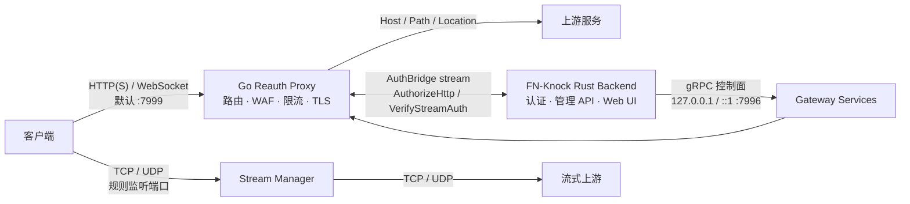

<div align="center">

# Go Reauth Proxy

**FN-Knock 的高性能 Go 网关数据面**

统一承载 HTTP(S)、WebSocket、TCP 与 UDP 流量，提供认证接入、动态路由、WAF、流量治理和本机 gRPC 控制面。


[](./LICENSE)

</div>

> [!IMPORTANT]
> 本仓库是 FN-Knock 的网关进程，不是独立的管理后台或认证服务。启动后会等待 Rust 后端建立 AuthBridge gRPC 长连接；两端必须使用相同的 `FN_KNOCK_INTERNAL_RPC_TOKEN`。

## 项目简介

Go Reauth Proxy 部署在应用与客户端之间，将多个本地、内网或远程服务收口到统一入口。数据面负责高并发转发和安全策略执行，Rust 后端通过仅监听回环地址的 gRPC 控制面管理配置、承载认证决策并对接前端管理界面。

| 能力 | 说明 |
| --- | --- |
| 多协议代理 | HTTP/HTTPS、WebSocket、TCP、UDP |
| 灵活路由 | Host、路径前缀、Host Location、默认路由与 TCP/UDP 端口规则 |
| 统一认证 | AuthBridge 联合鉴权、预检、登录跳转、认证缓存与高级策略 |
| TLS 入口 | HTTP/HTTPS 同端口、证书热更新、单证书与 Multi-SNI |
| 安全防护 | Coraza WAF、全局黑名单、访问范围、爬虫拦截、限流与 Linux iptables |
| 可观测性 | 访问日志、流量统计、活跃 IP、诊断端点与 Deep Monitor |
| 动态控制 | 配置热更新、原子持久化、本机 gRPC 控制面与健康检查 |

## 目录

- [运行架构](#运行架构)
- [核心特性](#核心特性)
- [快速开始](#快速开始)
- [路由配置](#路由配置)
- [认证与 TLS](#认证与-tls)
- [安全与流量治理](#安全与流量治理)
- [内部 gRPC 控制面](#内部-grpc-控制面)
- [配置参考](#配置参考)
- [日志与诊断](#日志与诊断)
- [开发与构建](#开发与构建)
- [部署注意事项](#部署注意事项)

## 运行架构



默认端口：

| 端口 | 角色 | 暴露范围 |
| --- | --- | --- |
| `7999` | HTTP/HTTPS/WebSocket 代理入口 | 由 `gateway_listener.scope` 控制 |
| `7996` | 内部 gRPC 控制面 | 固定为 `127.0.0.1` / `::1` |
| `7997` | Rust 认证 HTTP 服务 | 由 `auth_config.auth_port` 指定 |

代理入口使用 `cmux` 在同一端口识别明文 HTTP 与 TLS。部署证书后，符合条件的 HTTP 请求会以 `307 Temporary Redirect` 跳转到 HTTPS。

## 核心特性

### 路由与转发

- Host 精确匹配、路径最长前缀匹配和默认 Host/路径路由
- Host 规则支持独立 Location、可用时段、HTTP/1.1 / HTTP/2 策略和 Host 保留
- 路径规则支持 `StripPath`、HTML 绝对路径重写和根路径模式
- WebSocket 自动升级与双向转发
- TCP/UDP 监听规则热更新，可按规则启用认证
- 内置应用选择页、悬浮工具栏、图标与多语言响应页面

### 认证与访问控制

- Rust AuthBridge 长连接承载 HTTP 和 TCP/UDP 鉴权
- `AuthorizeHttp` 联合鉴权，并兼容旧后端的 `VerifyAuth + PreflightAuth` 流程
- 登录跳转、短时鉴权缓存、Host 高级认证策略与临时授权
- 全局、Host 级访问范围及可信客户端 IP 绕过策略
- 阿里云 ESA、腾讯 EdgeOne 与标准转发头来源 IP 识别

### 安全与可观测性

- Coraza WAF：`off`、`detection`、`blocking` 三种模式
- 基于客户端 IP 的令牌桶限流与超限临时阻断
- 全局黑名单、爬虫拦截和常见路径例外策略
- Linux iptables/ip6tables 白名单、黑名单、SSH 防火墙与端口重定向
- 请求日志、流量计数、活跃连接/IP、5xx 统计
- Deep Monitor 按 Host 捕获 HTTP 交换与 WebSocket 帧，支持查询和归档导出

## 快速开始

### 环境要求

- Go `1.25+`；仓库通过 `toolchain` 指定 Go `1.26.5`
- 可选：[Task](https://taskfile.dev/) 用于统一执行构建与测试命令
- 配套的 FN-Knock Rust 后端，用于建立 AuthBridge 和管理网关
- 使用防火墙能力时需要 Linux、`iptables` / `ip6tables` 及相应权限

### 1. 准备配置

首次启动会在配置路径创建默认 `config.json`。开发环境也可以从最小配置开始：

```json
{
  "rules": [],
  "host_rules": [],
  "stream_rules": [],
  "default_route": "/__select__",
  "auth_config": {
    "auth_port": 7997,
    "auth_url": "/api/auth/verify",
    "login_url": "/login",
    "logout_url": "/api/auth/logout",
    "preflight_url": "/api/auth/preflight",
    "auth_cache_ttl_seconds": 1,
    "auth_cache_unauthorized_ttl_seconds": 1
  },
  "admin_port": 7996,
  "gateway_listener": {
    "scope": "all"
  },
  "reverse_proxy_throttle": {
    "enabled": true,
    "requests_per_second": 100,
    "burst": 200,
    "block_seconds": 30
  }
}
```

### 2. 启动网关

先确保 Rust 后端会使用同一个内部 RPC token 连接网关，然后运行：

```bash
export FN_KNOCK_INTERNAL_RPC_TOKEN='replace-with-a-long-random-token'
task run -- -proxy-port 7999 -admin-port 7996 -c ./config.json
```

不使用 Task：

```bash
FN_KNOCK_INTERNAL_RPC_TOKEN='replace-with-a-long-random-token' \
  go run ./cmd/server -proxy-port 7999 -admin-port 7996 -c ./config.json
```

> [!NOTE]
> 网关最多等待 AuthBridge 就绪 60 秒，成功后才开放代理监听端口。没有配套 Rust 后端时，进程会因等待超时退出。

### 3. 启动参数

| 参数 | 默认值 | 说明 |
| --- | --- | --- |
| `-proxy-port` | `7999` | HTTP/HTTPS 反向代理端口 |
| `-admin-port` | `7996` | 内部 gRPC 端口；传 `0` 时使用配置值 |
| `-c` | 可执行文件目录下的 `config.json` | 配置文件或配置目录路径 |
| `-logs-dir` | 配置目录下的默认日志目录 | 网关访问日志目录，必须为绝对路径 |
| `-waf-dir` | 配置目录下的 `waf` | WAF 规则与状态目录，必须为绝对路径 |

## 路由配置

三类规则都通过内部 gRPC 控制面全量更新，并原子写回 `config.json`。

### Host 路由

适合为不同域名映射独立应用：

```json
{
  "host": "app.example.com",
  "target": "http://127.0.0.1:8080",
  "protocol_mode": "auto",
  "use_auth": true,
  "access_mode": "login_first",
  "preserve_host": true,
  "visibility": {
    "mode": "inherit"
  },
  "title": "Example App",
  "locations": [
    {
      "path": "/api",
      "match": "prefix",
      "action": "proxy",
      "target": "http://127.0.0.1:9000",
      "strip_path": false
    }
  ]
}
```

- `host` 为精确域名，不接受路径或通配符
- `protocol_mode` 可为 `auto`、`http1`、`http2`
- `locations` 可将 Host 下的路径转发到不同上游，或直接返回固定响应
- `disabled`、`availability`、`visibility` 可控制规则启用状态、时段和来源范围
- `basic_auth` 用于向可信上游注入 Basic Auth，不是面向访客的登录机制

Host 目标中可附带入口路径。例如 `http://127.0.0.1:19122/p` 仅把公开根请求 `/` 映射到 `/p`；`/assets/app.js` 等非根路径仍按原路径转发。

### 路径路由

适合在同一个 Host 下按前缀挂载服务：

```json
{
  "path": "/grafana",
  "target": "http://127.0.0.1:3000",
  "use_auth": true,
  "strip_path": true,
  "rewrite_html": true,
  "use_root_mode": false
}
```

- 多条规则按最长路径前缀匹配
- 非根规则收到 `/grafana` 时会重定向到 `/grafana/`
- `strip_path` 删除匹配前缀后再转发
- `rewrite_html` 为 HTML 中的绝对 `href`、`src`、`action` 与 `<base href>` 补上挂载前缀
- `use_root_mode` 将命中路径写入 `__proxy_path` Cookie 后跳转到 `/`

根路径没有直接命中时，网关依次考虑默认 Host、`__proxy_path`、`default_route`，最后进入 `/__select__` 或返回未匹配页面。该行为也可以通过 `unmatched_route` 调整为直接重置连接。

### TCP / UDP 路由

```json
{
  "protocol": "tcp",
  "listen_port": 3307,
  "target": "127.0.0.1:3306",
  "use_auth": true
}
```

`protocol` 支持 `tcp` 和 `udp`。监听端口不能与网关内部端口冲突，也不能转发回相同的本地监听地址。开启 `use_auth` 后，连接或会话建立前会通过 AuthBridge 执行 `VerifyStreamAuth`。

## 认证与 TLS

### AuthBridge 流程

1. Rust 后端以客户端身份连接 `127.0.0.1:7996`，建立长生命周期 AuthBridge stream。
2. 请求命中 `use_auth=true` 的规则后，Go 将 Cookie、Authorization、来源 IP 和路由上下文发送给 Rust。
3. Rust 返回允许、拒绝或重定向决策；未登录用户会进入 `/__auth__/login?redirect_uri=...`。
4. `/__auth__/*` 由网关转发到 `auth_config.auth_port` 指定的 Rust HTTP 认证服务。

联合鉴权协议通过 `authorize_http_v1` capability 协商。滚动升级时应先发布 Rust 后端，再发布 Go 网关；旧 Rust 后端会自动继续使用双调用流程。

### TLS 入口

- `single_active`：部署一个活动证书
- `multi_sni`：按 SNI 选择多个证书，支持精确域名和合法的单级通配符
- 最低 TLS 版本为 TLS 1.2
- Host 规则可按 SNI 独立选择 HTTP/1.1、HTTP/2 或自动协商
- 证书热更新后会安全淘汰受影响的空闲连接

如果网关位于 NAT、端口映射或边缘代理之后，可通过公开端口和认证地址修正跳转 URL：

```json
{
  "auth_config": {
    "public_http_port": 80,
    "public_https_port": 443,
    "public_auth_base_url": "https://auth.example.com"
  }
}
```

## 安全与流量治理

### WAF

WAF 基于 [Coraza](https://coraza.io/)，从 `waf.rules_dir` 加载规则包：

| 模式 | 行为 |
| --- | --- |
| `off` | 不执行 WAF |
| `detection` | 记录命中事件，但不阻断请求 |
| `blocking` | 按规则与异常阈值阻断请求 |

配置支持 paranoia level、入站/出站异常阈值、请求体限制，以及按 Host 或路径前缀停用 WAF。WAF 默认未启用。

### 反向代理限流

`reverse_proxy_throttle` 对命中的 Host/Path 规则和 `/__auth__` 代理路径按客户端 IP 限流，不影响内部 gRPC、应用选择页和未命中页面。超限后连接会在 `block_seconds` 内被直接拒绝。

### Linux 防火墙

Linux 构建提供 `firewall.iptables` capability，可管理 iptables/ip6tables、自定义链、白名单、黑名单、SSH 防火墙和 TCP 重定向。非 Linux 平台仍注册 `FirewallService`，但方法统一返回 gRPC `Unimplemented`。

防火墙链初始化的基础顺序为：

1. 放行 loopback
2. 放行 `ESTABLISHED,RELATED`
3. 放行配置的本地网段、ICMP 和例外端口
4. 应用白名单/黑名单规则
5. 默认拒绝其余流量

默认自定义链名为 `REAUTH_FW`，父链为 `INPUT` 与 `DOCKER-USER`。

## 内部 gRPC 控制面

控制面固定绑定 `127.0.0.1` 与 `::1`，所有 unary、stream 和标准 health 请求都要求携带 `FN_KNOCK_INTERNAL_RPC_TOKEN` 对应的 metadata。这里没有 HTTP Admin API，浏览器管理后台应访问 Rust 后端提供的 HTTP API。

| 服务 | 职责 |
| --- | --- |
| `GatewayControlService` | 运行信息、路由、认证、监听范围及网关策略 |
| `GatewayLogsService` | 日志配置、日期查询、分页读取与删除 |
| `DeepMonitorService` | 监控会话、事件流、Payload 与归档 |
| `SecurityService` | 全局黑名单与安全状态 |
| `TrafficService` | 流量统计、Host 活跃 IP |
| `WafService` | WAF 状态、配置、规则验证与事件流 |
| `SslService` | 证书部署、查询与清除 |
| `FirewallService` | Linux 防火墙与端口重定向 |
| `AuthBridgeService` | HTTP/TCP/UDP 鉴权双向流 |

健康检查服务名：

- `fnknock.gateway.process`
- `fnknock.gateway.dataplane`
- `fnknock.gateway.auth_bridge`

控制协议的唯一来源是相邻 FN-Knock 仓库中的 `packages/grpc-contracts/proto/fnknock/v1/gateway.proto`。同步生成代码：

```bash
# 在 fn-knock 根目录执行
npm run fn-knock:grpc:sync-go
npm run fn-knock:grpc:check-go
```

## 配置参考

配置由 gRPC 控制面热更新并原子持久化。运行中的网关应优先通过 Rust 后端管理，避免手工编辑与控制面更新互相覆盖。

| 顶层字段 | 用途 |
| --- | --- |
| `rules` | 路径前缀规则 |
| `host_rules` | Host 与 Host Location 规则 |
| `stream_rules` | TCP/UDP 监听规则 |
| `default_route` | 根路径默认路由，默认为 `/__select__` |
| `auth_config` | 认证服务、缓存、公开 URL 与边缘来源 IP 设置 |
| `admin_port` | 内部 gRPC 端口；仅在 `-admin-port=0` 时作为回退 |
| `gateway_listener.scope` | `all` 或 `loopback`；当前默认 `all` |
| `proxy_protocol_force` | 强制 PROXY protocol 场景；启用时代理只监听 loopback |
| `reverse_proxy_throttle` | 请求速率、突发容量与阻断时长 |
| `visibility` / `visibility_policies` | 全局与规则级编译 IP 集策略 |
| `forwarded_headers` / `preserve_host` | 转发头和原始 Host 策略 |
| `crawler_blocker` / `general_blacklist` | 爬虫和 IP 黑名单 |
| `portal` / `unmatched_route` | 应用选择页与未命中行为 |
| `logging` | 访问日志开关、本机请求记录与保留天数 |
| `waf` | Coraza WAF 模式、规则包和阈值 |
| `ssl` | `single_active` / `multi_sni` 证书部署 |
| `locale` | 内置页面默认语言 |
| `iptables_chain_name` | Linux 自定义防火墙链名 |

边缘来源 IP 识别由 `auth_config.edge_client_ip_enabled` 总开关控制。阿里云 ESA 与腾讯 EdgeOne 模式互斥；同时配置时会保留腾讯 EdgeOne。未启用受信边缘模式时，不应信任来自公网客户端自行提交的厂商来源头。

fn-knock 托管的 Cloudflare Tunnel 使用专用 loopback 入口作为请求头信任边界。若 Cloudflare 的 Pseudo IPv4 设置为 `Overwrite Headers`，网关会在 `CF-Connecting-IP` 属于 Class E `240.0.0.0/4` 时校验并恢复 `CF-Connecting-IPv6` 中的真实公网 IPv6；头部缺失或异常时保留 Pseudo IPv4 并继续按现有安全策略处理。非托管入口不会信任 `CF-Connecting-IPv6`，手工配置 Cloudflare 回源时建议将 Pseudo IPv4 设置为 `Off` 或 `Add Header`。

## 日志与诊断

| 环境变量 | 说明 |
| --- | --- |
| `FN_KNOCK_INTERNAL_RPC_TOKEN` | 必填，内部 gRPC 共享 token |
| `GO_REPROXY_PORT` | `-proxy-port` 的环境变量默认值 |
| `FN_KNOCK_GATEWAY_LOGS_DIR` | 访问日志绝对目录 |
| `FN_KNOCK_GATEWAY_WAF_DIR` | WAF 规则与状态绝对目录 |
| `GO_REPROXY_LOG=1` | 开启常规控制台日志 |
| `GO_REPROXY_DEBUG_LOG=1` | 开启结构化调试日志 |
| `GO_REPROXY_DEBUG_LOG_DIR` | 调试日志目录 |
| `GO_REPROXY_DIAGNOSTICS_ADDR` | 开启 loopback 诊断监听，如 `127.0.0.1:6060` |
| `FN_KNOCK_DISABLE_IPTABLES=1` | 禁用 iptables 能力 |
| `FN_KNOCK_IPTABLES_USE_SUDO` | 控制 iptables 命令是否通过 `sudo` 执行 |

访问日志由 `logging.enabled` 控制，默认关闭。`TrafficService` 提供总入站/出站字节、活跃身份、5xx、Host 活跃 IP 等运行统计。

诊断监听提供 `/debug/pprof/*` 与 `/debug/metrics`，只接受 loopback 地址，并要求请求携带：

```text
x-fn-knock-internal-rpc-token: <FN_KNOCK_INTERNAL_RPC_TOKEN>
```

也可使用同值的 Bearer token。未设置 `GO_REPROXY_DIAGNOSTICS_ADDR` 时不会启动诊断服务。

## 开发与构建

```bash
task build              # 构建全部支持的平台
task build:mac          # macOS ARM64
task build:linux        # Linux AMD64
task build:linux-arm64  # Linux ARM64
task build:linux-arm    # Linux ARMv7
task build:windows      # Windows AMD64

task run                # 本地运行
task test               # 全量测试
task test:race          # Race Detector
task bench:hot          # 热路径基准测试
task bench:all          # 全量基准测试
```

每个 PR 会在同一 CI runner 上将热路径 benchmark 与目标分支基线进行比较。基线和当前版本会先各执行一轮不计入结果的完整预热，再以交替顺序运行 6 轮独立样本，避免进程启动、CPU 初始调频、固定的先后顺序、热漂移或前序 benchmark 的自适应工作量系统性影响其中一方。比较器取每个 benchmark 的样本中位数：`ns/op`（等价吞吐门禁）最多回退 5%，`B/op` 与 `allocs/op` 最多回退 5%；考虑到 Go benchmark 将 `allocs/op` 报告为整数，该指标额外允许 1 个报告单位的绝对舍入余量。缺失的既有 benchmark 同样会使检查失败。这个门禁用于识别相对回退，实际绝对性能仍应以发布前的目标设备测量为准。

项目结构：

```text
cmd/server/          进程入口、HTTP/TLS 监听与内部 gRPC Server
pkg/proxy/           HTTP(S)、WebSocket、认证和策略执行核心
pkg/stream/          TCP/UDP 监听、会话与转发
pkg/admin/           gRPC 控制面服务实现
pkg/rpcbridge/       AuthBridge 与内部 token 校验
pkg/waf/             Coraza 规则加载、运行时与事件
pkg/deepmonitor/     深度监控会话、存储与归档
pkg/gatewaylog/      网关访问日志
pkg/iptables/        Linux iptables/ip6tables 管理
pkg/config/          配置默认值、加载与原子持久化
pkg/grpc/pb/         生成的 Protobuf / gRPC Go 代码
pkg/response/        内置页面、工具栏与错误响应
pkg/i18n/            内置页面多语言资源
```

## 部署注意事项

- 内部 gRPC 端口不是 HTTP 服务，不能使用 `curl http://127.0.0.1:7996/...` 访问。
- `SetRules`、`SetHostRules`、`SetStreamRules` 都是全量替换，不是增量追加。
- 反向代理目标可以是外部地址；安全校验只会阻止目标直接指向本机管理端口。请自行限制不可信的管理权限。
- 当前 HTTPS 上游连接会跳过上游证书校验，只应连接受信网络中的上游服务。
- 证书私钥、上游 Basic Auth 和其他敏感配置会持久化到 `config.json`，请严格控制文件权限与备份范围。
- `gateway_listener.scope=all` 会对外监听；不需要局域网访问时应改为 `loopback`。
- WAF、黑名单和 iptables 都可能中断真实流量，生产启用前应先使用检测模式或在受控环境验证。

## License

本项目基于 [MIT License](./LICENSE) 开源。
